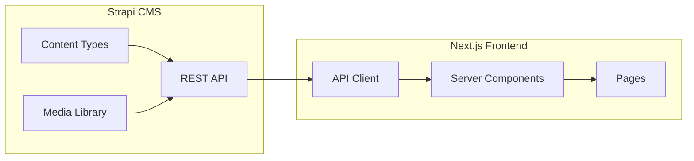

# Strapi CMS Integration for NCFG

## Overview

This plan covers setting up Strapi 5 CMS, designing content type schemas for your data (news, services, people), migrating existing JSON content, and integrating with the Next.js frontend.

## Current State

- Next.js frontend: `/web` directory
- Static JSON data files:
  - `web/public/content/news/ncfg_news.json` (11 news articles)
  - `web/public/content/ncfg_services.json` (3 categories, 12 services)
  - `web/public/content/ncfg_finzdorov_people.json` (24 people records)

## Project Structure

```
ncfg/
  apps/
    cms/               # NEW: Strapi 5 CMS
      src/
        api/           # Content types
        components/    # Reusable components
      config/
      public/
    web/               # Existing Next.js (move from /web)
```

## Part A: Strapi 5 Installation

### A1. Create Strapi Project

```bash
npx create-strapi@latest apps/cms
```

Installation options:

- Node.js: v20 or v22 (LTS)
- Package manager: pnpm (matching frontend)
- Database: SQLite for development, PostgreSQL for production
- TypeScript: Yes

### A2. Project Configuration

Create `.env` files and configure:

- Database connection
- JWT secrets
- Upload provider settings

## Part B: Content Type Schemas

### B1. News Article Collection Type

Based on [ncfg_news.json](web/public/content/news/ncfg_news.json):

```
news-article/
  - title (Text, required)
  - slug (UID from title, required)
  - body (Rich Text / Blocks)
  - anonsImage (Media, single image)
  - tags (Relation: many-to-many with Tag)
  - publishedAt (DateTime)
```

**Tag Collection Type:**

```
tag/
  - name (Text, required, unique)
  - slug (UID from name)
```

### B2. Service Catalog Structure

Based on [ncfg_services.json](web/public/content/ncfg_services.json):

**Service Category Collection Type:**

```
service-category/
  - title (Text, required)
  - slug (UID from title)
  - description (Text, long)
  - order (Integer)
  - services (Relation: one-to-many with Service)
```

**Service Collection Type:**

```
service/
  - title (Text, required)
  - slug (UID from title)
  - status (Enumeration: published, draft)
  - order (Integer)
  - shortDescription (Text)
  - fullDescription (Rich Text)
  - benefits (Component: repeatable text-item)
  - facts (Component: service-facts)
  - methodology (Component: repeatable methodology-item)
  - howWeWork (Component: repeatable text-item)
  - deliveryFormats (JSON / Text array)
  - topicsExample (Component: repeatable text-item)
  - examples (Component: repeatable service-example)
  - cta (Component: call-to-action)
  - category (Relation: many-to-one with ServiceCategory)
```

**Reusable Components:**

- `text-item`: { text: Text }
- `service-facts`: { experienceYears, developedBy, participantsCount, deliveryFormat, dataOutputs[] }
- `methodology-item`: { id, title, description }
- `service-example`: { title, type, link, description, notes }
- `call-to-action`: { label, type, url }

### B3. People/Experts Structure

Based on [ncfg_finzdorov_people.json](web/public/content/ncfg_finzdorov_people.json):

**Person Collection Type:**

```
person/
  - fullName (Text, required)
  - isTeam (Boolean)
  - isExpert (Boolean)
  - notes (Text)
  - photo (Media, single image)
  - team (Component: team-info)
  - expertProfile (Component: expert-profile)
```

**Components:**

- `team-info`: { unit, title, department }
- `expert-profile`: { headline, roles[], specialization, organization, registry, experienceYears, experienceText, metrics (Component), activities[], education[], background[], statuses[], products[], books[], mediaMentions[] }
- `expert-metrics`: { courseParticipants, moneySavedRub, returnedTaxesRub, eventsCount, audienceSize }

## Part C: Data Migration

### C1. Migration Scripts

Create Node.js scripts to:

1. Read existing JSON files
2. Transform data to Strapi format
3. Upload via Strapi REST API with authentication
4. Handle image uploads separately

Migration order (respecting relations):

1. Tags (from news tags)
2. Service categories
3. Services (with category relations)
4. People/Experts
5. News articles (with tag relations, image uploads)

### C2. Image Migration

- Copy images from `web/public/content/news/anonsImages/` to Strapi media library
- Update references in migrated content

## Part D: Next.js Integration

### D1. API Client Setup

Create Strapi API client in `web/shared/lib/strapi.ts`:

```typescript
const STRAPI_URL = process.env.STRAPI_URL;
const STRAPI_TOKEN = process.env.STRAPI_API_TOKEN;

export async function fetchAPI<T>(
  endpoint: string,
  options?: RequestInit
): Promise<T> {
  const res = await fetch(`${STRAPI_URL}/api${endpoint}`, {
    ...options,
    headers: {
      'Content-Type': 'application/json',
      Authorization: `Bearer ${STRAPI_TOKEN}`,
      ...options?.headers,
    },
    next: { revalidate: 60 }, // ISR
  });
  if (!res.ok) throw new Error(`API error: ${res.status}`);
  return res.json();
}
```

### D2. Data Fetching Functions

Create typed fetch functions:

- `getNews()`, `getNewsArticle(slug)`
- `getServices()`, `getServiceCategories()`
- `getPeople()`, `getTeamMembers()`, `getExperts()`

### D3. Update Pages

Modify existing pages to fetch from Strapi instead of JSON:

- `/app/blog/page.tsx` - news listing
- `/app/blog/[slug]/page.tsx` - news article
- `/app/about/page.tsx` - team/experts display
- Service catalog components

### D4. Environment Variables

Add to `web/.env.local`:

```
STRAPI_URL=http://localhost:1337
STRAPI_API_TOKEN=your-api-token
```

## Part E: Permissions and Security

### E1. API Token Configuration

- Create read-only API token for public content
- Set up permissions for each content type (find, findOne)

### E2. CORS Configuration

- Allow requests from `localhost:3000` (dev) and production domain

## Data Flow Diagram




## Files to Create/Modify

**New files:**

- `apps/cms/` - entire Strapi project
- `web/shared/lib/strapi.ts` - API client
- `web/shared/api/` - typed fetch functions
- `scripts/migrate-to-strapi.ts` - migration script

**Modified files:**

- `web/.env.local` - add Strapi env vars
- `web/app/blog/page.tsx` - fetch from Strapi
- `web/app/blog/[slug]/page.tsx` - fetch from Strapi
- `web/widgets/News/News.tsx` - update data source
- Team/Expert components - update data source

